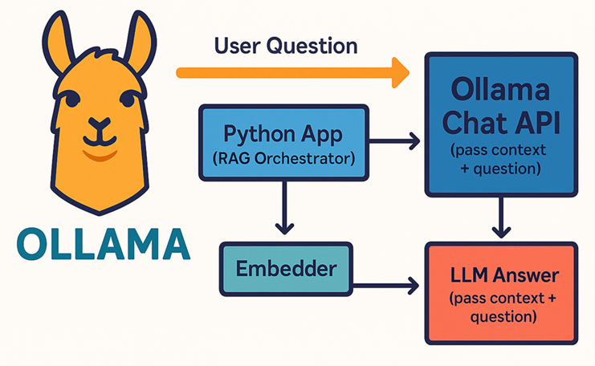
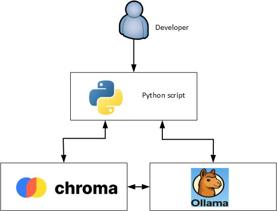
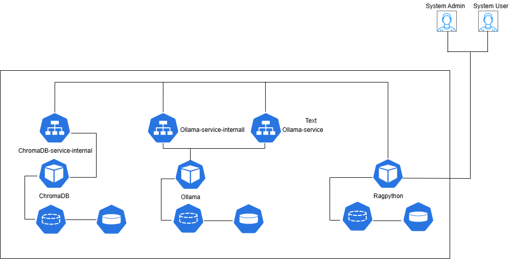

<div style="background-color: white; color: black; padding: 20px;">
<p><centr>Using RAG(Retrieval-Augmented Generation) with Ollama</center></p>

<p align="center"></p>

#### 1- Introduction into Retrieval-Augmented Generation (RAG)
<p>RAG (Retrieval-Augmented Generation) is a powerful and modern AI architecture designed to extend the knowledge base of an application in order to answer user queries more accurately. </p>
<p>RAG consists of two main components: retrieval and generation.</p>
<p>Retrieval involves searching for relevant information from a vector database that we have previously built using various documents.
Generation uses the retrieved knowledge to generate a response. This process involves transforming documents into chunks, storing them in a vector database, and then sending relevant chunks to an LLM (e.g., Ollama) to produce accurate and context-aware answers.</p>
<p>In this post, we will use ChromaDB as the vector database. For embedding (i.e., preparing document chunks for the vector database), we will use Ollama's embedding capabilities. We will also mention alternative techniques for vector databases and embedding processes.</p>
<p>Finally, the post will demonstrate how to implement the RAG pipeline within a Kubernetes environment.</p>
     
#### 2- Integration between knowledge base and Ollama in RAG
<p>
   Integration between a knowledge base (KB) and Ollama in a RAG (Retrieval-Augmented Generation) pipeline means combining external factual content (the KB) with LLM generation (via Ollama) to produce accurate, grounded responses.
</p>
   As we mention about RAG, we need to build our knowldge base to use with LLM. Build the knowledge base through Generation process.    
<p>   
   <b>The process of  Genaration</b> 
   A. Read the files or PDF 
   B. Divide the text/PDF file to chunks 
   C. Embedding: Convert text chunks into dense vectors using an embedding model
      The embeding models are different depennding on LLM models that uses with Ollama or OpenAI:
      - Ollama like llama3:embedding
      - OpenAI for cloud and online applications
</p>
<p>
    <b>The process of Querying the request to get the result from Ollama (LLM)</b>
</p>  
<p>
In our post, we will use the Ollama embedding to simplify the implementation and provide three examples to provide the full understangin
</p>

##### 3- Our implemenation in the post 
   <p>In our post, we will use the main three components Ollama, ChrmomaDB and python.
   <b>Ollama:</b> The platform for LLM. 
   <b>ChromaDB:</b> The vector database is using to keep the documents (after we divide the document to chuncks and embeding process. After that we can save it in the Chroma Database)
   <b>Python:</b> In this component, we have two scripts, the first script is to process to upload the documents to the Chroma Database. The second script is request query and get the output result     
   <p align="center"></p> 

##### 4- Impelemntation of RAG with Ollama on Kubernetes (MiniKube)
<p align="center"></p>
<p>
<b>A. Scalability</b><br>
Kubernetes enables you to independently scale each component of the RAG pipeline (e.g., Ollama, embedding service, vector database) based on demand. This ensures higher performance and reliability as workloads increase.
</p>

<p>
<b>B. Cost Efficiency & Resource Optimization</b><br>
Running RAG components on Kubernetes provides better control over compute resources. You can allocate CPU, memory, and even GPU usage per pod. In many cases, this setup is more cost-effective than using cloud-hosted LLM APIs, especially for long-running or high-volume applications.
</p>

<p>
<b>C. Local and Offline LLM Inference</b><br>
By deploying Ollama and the RAG pipeline on Kubernetes, you can run the entire system offline—ideal for secure, air-gapped environments. This is especially valuable in banking, finance, and government sectors, where external access is often restricted due to compliance or privacy regulations.
</p>

<p>
<b>D. Environment Isolation and Multi-Tenancy</b><br>
Kubernetes allows you to isolate environments easily. You can run multiple, independent instances of the full RAG pipeline (Ollama + vector DB + frontend) per department or team. This enables departmental autonomy while keeping data and processing pipelines securely separated.
</p>

#### 5- The benefit of adding RAG to Ollama: 
<p>Integrating RAG (Retrieval-Augmented Generation) with Ollama significantly enhances its capabilities by bridging the gap between the LLM's pretrained knowledge and your organization’s private, recent, or domain-specific data.</P>

<p>In many cases, company policies or security regulations prevent connecting LLMs to external cloud-based APIs. Additionally, even the most advanced LLMs cannot cover all topics or remain fully up to date. This is where RAG becomes essential — it allows Ollama to retrieve relevant, real-time or proprietary knowledge from internal sources, enabling the model to generate accurate and context-aware responses based on the latest and most relevant information. </p> 
   
#### 6- Using Vector database in the RAG: 
<p>
The vector database plays a central role in building an effective RAG (Retrieval-Augmented Generation) pipeline. It stores documents as numerical vector embeddings—mathematical representations of text—allowing the system to perform fast and accurate semantic searches.
</P>
<p>
When a user or system submits a query, it is also converted into a vector. The vector database then compares the query vector against the stored document vectors using similarity metrics to identify the most relevant content.
</p>
<p>
One common method is Euclidean distance, which measures the straight-line distance between vectors in the embedding space. Compared to traditional keyword-based text search, vector similarity search is significantly faster and more accurate when working with embedded data, especially for understanding meaning and context.
</p>

##### 7- Build docker and implement them on Kubernetes:

<p>As mention above that we will have three components. In thid post we will deal with three dockers. After that we will implement the three components on Minikuebe (Kubernetes)

##### Docker
<p>
<b>A. Build Ollama docker</b>
   In the our previos post, we built the Ollama docker <a href="https://github.com/alaasalmo/ollama-kubernetes/tree/main/ollama">Build Ollama docker</a>
</p>
<p>
<b>B. Build ChromaDB docker</b>

ChromaDB folder: <a href="chromadb/">chromadb/</a>

```
docker build -t chromadb .
```
Check the docker run
```
mkdir /c/alaa/kubernetes/ollama/RAG/chromadb/volume
docker run -d --name chromadb-pip -p 8000:8000 -v /c/alaa/kubernetes/ollama/RAG/chromadb/volume:/app/chroma chromadb
docker ps 
```

Build the image and push it to docker hub
```
docker images
docker tag <image-id> alaasalmo/chromadb:1.0.0.0
docker tag 9886d6ea3f14 alaasalmo/chromadb:1.0.0.0
docker push alaasalmo/chromadb:0.0.0.1
```
</p>
<p>
<b>C. Build ragpython docker</b>

```
docker build -t ragpython .
```

Run the image and checl the image run
```
mkdir -p /c/alaa/kubernetes/ragpython
docker run -d --name ragpython -v /c/alaa/kubernetes/ragpython:/app/ ragpython
docker ps
```

Push the image to the docker hub
```
docker images
docker tag <image-id> alaasalmo/ragpython:1.0.0.0
docker push alaasalmo/ragpython:1.0.0.0
```
</p>

<b>Build the pods on Minikube</b>
<p>
<b>A. Build Ollama pod </b>

In the our previos post, we built the Ollama docker <a href="https://github.com/alaasalmo/ollama-kubernetes/tree/main/ollama">Build Ollama docker</a>

```
minikube ssh
sudo mkdir /mnt
sudo midor /mnt/data
sudo chmod 777 -R /mnt/data/ollama
exit
```

```
kubectl apply -f pv.yaml
kubectl apply -f pvc.yaml
kubectl apply -f ollama-deployment.yaml
```
</p>
<p>
<b>B. Build Chroma DB pod </b>

ChromaDB folder: <a href="chromadb/">chromadb/</a>

```
minikube ip
sudo mkdir -p /data/chromadb
sudo chmod 777 -R /data/chromadb
exit
```

```
kubectl apply -f pv.yaml
kubectl apply -f pvc.yaml
kubectl apply -f chromadb-deployment.yaml
kubectl apply -f chromedb-service.yaml
```
</p>
<p>
<b>C. Build RAG Python pod </b>

RAGpython folder: <a href="ragpython/">ragpython/</a>

```
minikube ssh
sudo midir -p /rag/script
sudo chmod 777 -R /rag/script
exit
```

```
kubectl apply -f pv.yaml
kubectl apply -f pvc.yaml
kubectl apply -f ragpython-deployment.yaml
kubectl apply -f ragpython-service.yaml
```
</p>

##### 8- Review the scripts and upload the script files to the RAGpython
<p>
A. Run the pods to check the three pods 

```
kubectl get pods
```
B. Run the model in the pod
```
kubectl exec -it $(kubectl get pods -l app=ollama -o jsonpath='{.items[0].metadata.name}') -- ollama pull llama3
kubectl exec -it $(kubectl get pods -l app=ollama -o jsonpath='{.items[0].metadata.name}') -- ollama pull llama3.2:1b
```
</p>
<p>
C. Upload the files (python files) to the RAGpython pod

<a href="scripts/sample.txt">sample.txt</a>
```
kubectl cp sample.txt $(kubectl get pods -l app=ragpython -o jsonpath='{.items[0].metadata.name}'):/app/rag/

```
<a href="scripts/chromadb-example1.py">chromadb-example1.py</a>

Explanation: the file chromadb-example1.py consist of:

<b>Step 1: Read and Chunk the File</b><br>
Read the file line by line. Each line is divided into chunks based on a predefined chunk size. To preserve context between chunks, an overlap is added based on the previous chunk.

<b>Step 2: Embed Chunks Using Ollama</b><br>
Use the Ollama API to embed the text chunks with a specific model. This step converts the textual data into vector representations.

<b>Step 3: Save to ChromaDB</b><br>
Store the embedded chunks in ChromaDB, a vector database optimized for similarity search.

<b>Step 4: Query and Retrieve Results</b><br>
When a client query is received, it is first embedded. Then, a similarity search is performed against the stored chunks to find the most relevant ones. These chunks, along with the query, are passed to the LLM models in the Ollama to generate the final answer.

```
kubectl cp chromadb-example1.py $(kubectl get pods -l app=ragpython -o jsonpath='{.items[0].metadata.name}'):/app/rag/
kubectl exec -it $(kubectl get pods -l app=ragpython -o jsonpath='{.items[0].metadata.name}') -- python /app/rag/chromadb-example1.py
```
<a href="scripts/chromadb-example2.py">chromadb-example2.py</a>

<b>Step 1: Input an Array of Text</b><br>
<p>A class is defined to accept an array of text documents as input. The output is also an array of text, typically retrieved as search results.</p>

<b>Step 2: Initialize the ChromaDB Client</b><br>
<p>Initialize the Chroma vector database client to enable storage and querying of embedded documents.</p>

<b>Step 3: Set Up the Collection with an Embedding Function</b><br>
<p>Create a collection and assign an embedding_function. When documents are added in the next step, the system will automatically embed them using this function.</p>

<b>Step 4: Add Documents</b><br>
<p>Prepare an array of documents and add them to the collection. As they are added, each document is embedded and stored in the vector database.</p>

<b>Step 5: Query Using Embedded Input</b><br>
<p>Submit a query in plain text. The system automatically embeds the query and compares it with the stored document embeddings to retrieve the most relevant chunks for the LLM.</p>

<b>Step 6: Print the Results</b>
<p>Display the search results returned by ChromaDB based on the embedded query.</p>

```
kubectl cp chromadb-example2.py $(kubectl get pods -l app=ragpython -o jsonpath='{.items[0].metadata.name}'):/app/rag/
kubectl exec -it $(kubectl get pods -l app=ragpython -o jsonpath='{.items[0].metadata.name}') -- python /app/rag/chromadb-example2.py
```
<a href="scripts/chromadb-example3.py">chromadb-example3.py</a>

<b>Step 1: Define custom embedding_function</b><br>
<p>A class is defined to accept an array of text documents as input. The output is also an array of text, typically retrieved as search results.</p>
<b>Step 2: Initialize ChromaDB client</b><br>
<p>Initialize the Chroma vector database client to enable storage and querying of embedded documents.</p>
<b>Step 3: Setup collection with embedding_function</b><br>
<p>Create a collection and assign an embedding_function.
When documents are added in the next step, the system will automatically embed them using this function.</p>
<b>Step 4: Add documents</b><br>
<p>Prepare an array of documents and add them to the collection.
As they are added, each document is embedded and stored in the vector database.</p>
<b>Step 5: Query with embedding_function auto-used</b><br>
<p>Submit a query in plain text.
The system automatically embeds the query and compares it with the stored document embeddings to retrieve the most relevant chunks for the LLM.</p>
<b>Step 6: Print top results and collect context</b><br>
<p>Display the search results returned by ChromaDB based on the embedded query.</p>
<b>Step 7: Chat-based answer generation using LLM</b><br>
<p>We have to setup the role of system and user to use them in the next step for chatting</p> 
<b>Step 8: Call LLM with chat</b><br>
<p>The client asks another question depending on chatting and the system will answer depengin on previous questions</p>

```
kubectl cp chromadb-example3.py $(kubectl get pods -l app=ragpython -o jsonpath='{.items[0].metadata.name}'):/app/rag/
kubectl exec -it $(kubectl get pods -l app=ragpython -o jsonpath='{.items[0].metadata.name}') -- python /app/rag/chromadb-example3.py
```
</p>
<p>
D. Run the scripts for python in the pod

```
kubectl exec -it $(kubectl get pods -l app=ragpython -o jsonpath='{.items[0].metadata.name}') bash

cd /app/rag

python chromadb-example1.py

python chromadb-example2.py

python chromadb-example3.py
```
</p>
</div>