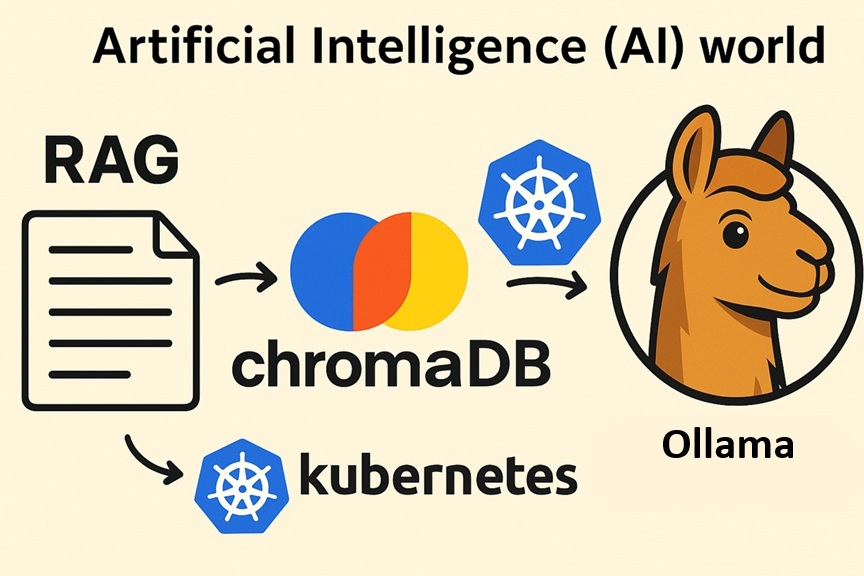
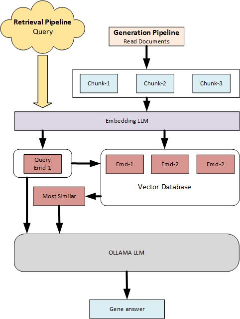
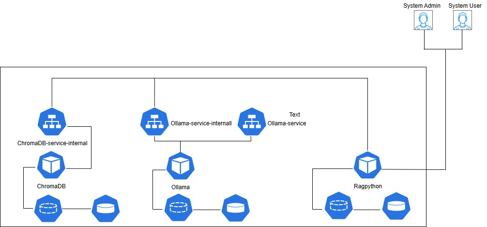

<div style="background-color: white; color: black; padding: 20px;">
<p><center><font size="14">RAG(Retrieval-Augmented Generation) with Ollama on Kubernetes</font></center></p>

<p align="center"></p>

### 1- Introduction into Retrieval-Augmented Generation (RAG)
<p>RAG (Retrieval-Augmented Generation) is a powerful and modern AI architecture designed to extend the knowledge base of an application in order to answer user queries more accurately. </p>
<p>RAG consists of two main components: retrieval and generation.</p>
<p>Retrieval involves searching for relevant information from a vector database that we have previously built using various documents.
Generation uses the retrieved knowledge to generate a response. This process involves transforming documents into chunks, storing them in a vector database, and then sending relevant chunks to an LLM (e.g., Ollama) to produce accurate and context-aware answers.</p>
<p>In this article, we will use ChromaDB as the vector database. For embedding (i.e., preparing document chunks for the vector database), we will use Ollama's embedding capabilities. We will also mention alternative techniques for vector databases and embedding processes.</p>
<p>Finally, the article will demonstrate how to implement the RAG pipeline within a Kubernetes environment.</p>
     
### 2- Integration of Knowledge Bases with Ollama in a RAG Pipeline

<b>Concept of RAG (Retrieval-Augmented Generation) with LLM:</b><br>
RAG integrates a knowledge base (KB) with a Large Language Model (LLM) to generate accurate, grounded, and context-aware answers. The KB provides factual content, while the LLM (e.g., via Ollama) handles reasoning and natural language generation.

<b>A. Knowledge Base Construction (Generation Pipeline)</b><br>
This step builds the knowledge base that the LLM can reference later.<br>
<b>Steps:</b><br>
<p><b>First: Read and Ingest Documents</b><br>
Import data from files, PDFs, or other sources.<br></p>
<p><b>Second: Chunking</b><br>
Split documents into smaller, semantically meaningful chunks (e.g., paragraphs or fixed-length tokens). <br>
Chunking ensures embeddings capture local context without exceeding model token limits.</p>
<p><b>Third: Embedding Generation</b><br>
Convert each text chunk into a dense vector representation using an embedding model.<br>
Choice of embedding model depends on the LLM setup:<br>
Ollama (local) → e.g., llama3:embedding<br> 
OpenAI (cloud) → e.g., text-embedding-3-small or text-embedding-3-large
</p>
<p><b>Fourth: Vector Database Storage</b><br>
Store embeddings (with their text chunks as metadata) in a vector database for efficient similarity search.<br>
Example: ChromaDB, <br>
         Radis stack<br> 
         Milvus.<br> 
These databases work with Kubernetes</p>

<b>B. Retrieval-Augmented Querying (Retrieval Pipeline)</b><br>
This step runs when a client asks a question.<br>

<b>Steps:</b><br>

<p><b>First: Query Input</b><br>
The user submits a question.
</p>
<p><b>Second: Query Embedding</b><br>
Convert the query into an embedding vector using the same embedding model used during KB construction.
</p>
<p>
<b>Third: Similarity Search</b><br>
Compare the query embedding with stored embeddings in the vector database.<br>
Retrieve the most relevant chunks (top-k matches).<br>
Augmented Prompt Construction<br>
Combine the original query with retrieved chunks to create a context-rich prompt.
</p>
<p>
<b>Fourth: LLM Response Generation</b><br>
Send the prompt to the LLM (via Ollama or OpenAI).The LLM uses the external knowledge from retrieved chunks to produce an accurate, grounded answer.</p>
<p>
In our post, we will use the Ollama embedding to simplify the implementation and provide examples to provide the full understanding
</p>
<p>The diagram below explain the two pipelines (Generation Pipeline & Retrieval Pipeline)</p>

<p align="center"></p>


### 3- Types of RAG depending on implementation
   <p>Naive RAG and advanced RAG
   <b>RAG</b> (Retrieval-Augmented Generation) can be implemented in two main ways: <b>Naive RAG</b> and <b>Advanced RAG</b>, each with different features and implementation complexity.

<b>Naive RAG</b> is the standard approach to RAG implementation. It retrieves relevant documents based on the original query and passes them directly to the model without additional processing.

<b>Advanced RAG</b>, on the other hand, involves additional processing steps to refine the query and improve retrieval accuracy. This approach requires more processing time to reconstruct the client request (query) but generally produces more accurate results. Advanced RAG often incorporates techniques such as query rewriting, query expansion, re-ranking, and context summarization.

In our  python example script files: We will have example of Naive RAG and advanaed RAG.
The final script in our repository represents an Advanced RAG implementation. For Advanced RAG, there are two primary ways to improve the query:

Query rewriting – reformulating the original query to make it clearer and more effective for retrieval.
Query expansion – generating multiple related queries from the original one to cover a broader range of relevant information.

from query rewriting and query expansion, the query expansion generally yields more accurate results than query rewriting. 
<table>
  <tr style="background-color:white;">
    <td><b>Feature</b></td>
    <td><b>Naive RAG</b></td>
    <td><b>Advanced RAG</b></td>
  </tr>
  <tr style="background-color:white;">
    <th>Query Handling</th>
    <td>Direct user query</td>
    <td>Query rewriting / expansion</td>
  </tr>
  <tr style="background-color:white;">
    <th>Retrieval</th>
    <td>Top-k similarity</td>
    <td>Hybrid search, metadata filters</td>
  </tr>
  <tr style="background-color:white;">
    <th>Context</th>
    <td>All retrieved chunks dumped</td>
    <td>Re-ranked, deduped, summarized</td>
  </tr>
  <tr style="background-color:white;">
    <th>Hallucination</th>
    <td>Risk Higher</td>
    <td>Risk Lower</td>
  </tr>
    <tr style="background-color:white;">
    <th>Token Efficiency</th>
    <td>Poor</td>
    <td>Optimized</td>
  </tr>
    </tr>
    <tr style="background-color:white;">
    <th>Complexity</th>
    <td>Low</td>
    <td>Higher</td>
  </tr>
</table>

<b>The main steps for Advanced RAG</b>

A- Ingestion & indexing (ChromaDB)<br>
Chunk your docs → embed chunks → upsert into a ChromaDB collection with metadata (source, page, section, etc.).<br>
B- Query processing<br>
Either rewrite the query for clarity or do query expansion (generate several semantically-related queries).<br>
C- Retrieval from ChromaDB<br>
D- Re-ranking (vs. original query)<br>
Score retrieved chunks against the original user query (e.g., cross-encoder, LLM scoring, or a lightweight cosine pass).<br>
E-Context summarization<br>
Compress top-K chunks to fit your model’s context window (map-reduce summary or extractive compression).<br>
F-Generation<br>
Feed the summarized context to the LLM to produce the final answer.<br>

### 4- Our implementation in this article 
   <p>In our article, we will use the main three components Ollama, ChrmomaDB and python.
   <b>Ollama:</b> The platform for LLM. 
   <b>ChromaDB:</b> The vector database is using to keep the documents (after we divide the document to chuncks and embeding process. After that we can save it in the Chroma Database)
   <b>Python:</b> In this component, we have two scripts, the first script is to process to upload the documents to the Chroma Database. The second script is request query and get the output result     
   <p align="center"></p> 

### 5- Vector database
<p>
A vector database is a storage system for document chunks after they’ve been converted into embeddings.
When a query is made, the system searches the database for the most relevant chunk using a distance metric, such as:

Cosine similarity – most common for embeddings <br>
Euclidean distance (L2)<br>
Dot product<br>

In this article, we use ChromaDB as our vector database.
Other high-performance options include Milvus and Redis, both of which can run on Kubernetes for scalability. We choose ChromaDB for its simplicity and ease of integration, making it ideal for our example.
</p>

### 6- Implementation of RAG with Ollama on Kubernetes (MiniKube)

<p align="center"></p>
<p>
<b>A. Scalability</b><br>
Kubernetes enables you to independently scale each component of the RAG pipeline (e.g., Ollama, embedding service, vector database) based on demand. This ensures higher performance and reliability as workloads increase.
</p>

<p>
<b>B. Cost Efficiency & Resource Optimization</b><br>
Running RAG components on Kubernetes provides better control over compute resources. You can allocate CPU, memory, and even GPU usage per pod. In many cases, this setup is more cost-effective than using cloud-hosted LLM APIs, especially for long-running or high-volume applications.
</p>

<p>
<b>C. Local and Offline LLM Inference</b><br>
By deploying Ollama and the RAG pipeline on Kubernetes, you can run the entire system offline—ideal for secure, air-gapped environments. This is especially valuable in banking, finance, and government sectors, where external access is often restricted due to compliance or privacy regulations.
</p>

<p>
<b>D. Environment Isolation and Multi-Tenancy</b><br>
Kubernetes allows you to isolate environments easily. You can run multiple, independent instances of the full RAG pipeline (Ollama + vector DB + frontend) per department or team. This enables departmental autonomy while keeping data and processing pipelines securely separated.
</p>

### 7- The benefit of adding RAG to Ollama 
<p>Integrating RAG (Retrieval-Augmented Generation) with Ollama significantly enhances its capabilities by bridging the gap between the LLM's pretrained knowledge and your organization’s private, recent, or domain-specific data.</P>

<p>In many cases, company policies or security regulations prevent connecting LLMs to external cloud-based APIs. Additionally, even the most advanced LLMs cannot cover all topics or remain fully up to date. This is where RAG becomes essential — it allows Ollama to retrieve relevant, real-time or proprietary knowledge from internal sources, enabling the model to generate accurate and context-aware responses based on the latest and most relevant information. </p> 
   
### 8- Using Vector database in the RAG
<p>
The vector database plays a central role in building an effective RAG (Retrieval-Augmented Generation) pipeline. It stores documents as numerical vector embeddings—mathematical representations of text—allowing the system to perform fast and accurate semantic searches.
</P>
<p>
When a user or system submits a query, it is also converted into a vector. The vector database then compares the query vector against the stored document vectors using similarity metrics to identify the most relevant content.
</p>
<p>
One common method is Euclidean distance, which measures the straight-line distance between vectors in the embedding space. Compared to traditional keyword-based text search, vector similarity search is significantly faster and more accurate when working with embedded data, especially for understanding meaning and context.
</p>

### 9- Build docker and implement them on Kubernetes

<p>As mention above that we will have three components. In thid post we will deal with three dockers. After that we will implement the three components on Minikuebe (Kubernetes)

##### Docker
<p>
<b>A. Build Ollama docker</b>
   In the our previous article, we built the Ollama docker <a href="https://github.com/alaasalmo/ollama-kubernetes/tree/main/ollama">Build Ollama docker</a>
</p>
<p>
<b>B. Build ChromaDB docker</b>

ChromaDB folder: <a href="chromadb/">chromadb/</a>

```
docker build -t chromadb .
```
Check the docker run
```
mkdir /c/alaa/kubernetes/ollama/RAG/chromadb/volume
docker run -d --name chromadb-pip -p 8000:8000 -v /c/alaa/kubernetes/ollama/RAG/chromadb/volume:/app/chroma chromadb
docker ps 
```

Build the image and push it to docker hub
```
docker images
docker tag <image-id> alaasalmo/chromadb:1.0.0.0
docker tag 9886d6ea3f14 alaasalmo/chromadb:1.0.0.0
docker push alaasalmo/chromadb:0.0.0.1
```
</p>
<p>
<b>C. Build ragpython docker</b>

```
docker build -t ragpython .
```

Run the image and checl the image run
```
mkdir -p /c/alaa/kubernetes/ragpython
docker run -d --name ragpython -v /c/alaa/kubernetes/ragpython:/app/ ragpython
docker ps
```

Push the image to the docker hub
```
docker images
docker tag <image-id> alaasalmo/ragpython:1.0.0.0
docker push alaasalmo/ragpython:1.0.0.0
```
</p>

<b>Build the pods on Minikube</b>
<p>
<b>A. Build Ollama pod </b>

In the our previos post, we built the Ollama docker <a href="https://github.com/alaasalmo/ollama-kubernetes/tree/main/ollama">Build Ollama docker</a>

```
minikube ssh
sudo mkdir /mnt
sudo midor /mnt/data
sudo chmod 777 -R /mnt/data/ollama
exit
```

```
kubectl apply -f pv.yaml
kubectl apply -f pvc.yaml
kubectl apply -f ollama-deployment.yaml
```
</p>
<p>
<b>B. Build Chroma DB pod </b>

ChromaDB folder: <a href="chromadb/">chromadb/</a>

```
minikube ip
sudo mkdir -p /data/chromadb
sudo chmod 777 -R /data/chromadb
exit
```

```
kubectl apply -f pv.yaml
kubectl apply -f pvc.yaml
kubectl apply -f chromadb-deployment.yaml
kubectl apply -f chromedb-service.yaml
```
</p>
<p>
<b>C. Build RAG Python pod </b>

RAGpython folder: <a href="ragpython/">ragpython/</a>

```
minikube ssh
sudo midir -p /rag/script
sudo chmod 777 -R /rag/script
exit
```

```
kubectl apply -f pv.yaml
kubectl apply -f pvc.yaml
kubectl apply -f ragpython-deployment.yaml
kubectl apply -f ragpython-service.yaml
```
</p>

##### 10- Review the scripts and upload the script files to the RAGpython
<p>
A. Run the pods to check the three pods 

```
kubectl get pods
```
B. Run the model in the pod
```
kubectl exec -it $(kubectl get pods -l app=ollama -o jsonpath='{.items[0].metadata.name}') -- ollama pull llama3
kubectl exec -it $(kubectl get pods -l app=ollama -o jsonpath='{.items[0].metadata.name}') -- ollama pull llama3.2:1b
```
</p>
<p>
C. Upload the files (python files) to the RAGpython pod

<a href="https://github.com/alaasalmo/ollama-rag-kubernetes/blob/main/script/sample.txt">sample.txt</a>
```
kubectl cp sample.txt $(kubectl get pods -l app=ragpython -o jsonpath='{.items[0].metadata.name}'):/app/rag/

```
<a href="https://github.com/alaasalmo/ollama-rag-kubernetes/blob/main/script/chromadb-example1.py">chromadb-example1.py</a> <b>(Naive RAG implementation)</b>

<b>Embeded method:</b> ollama.embeddings (Ollama)

Explanation: the file chromadb-example1.py consist of:

<b>Step 1: Read and Chunk the File</b><br>
Read the file line by line. Each line is divided into chunks based on a predefined chunk size. To preserve context between chunks, an overlap is added based on the previous chunk.

<b>Step 2: Embed Chunks Using Ollama</b><br>
Use the Ollama API to embed the text chunks with a specific model. This step converts the textual data into vector representations.

<b>Step 3: Save to ChromaDB</b><br>
Store the embedded chunks in ChromaDB, a vector database optimized for similarity search.

<b>Step 4: Query and Retrieve Results</b><br>
When a client query is received, it is first embedded. Then, a similarity search is performed against the stored chunks to find the most relevant ones. These chunks, along with the query, are passed to the LLM models in the Ollama to generate the final answer.

```
kubectl cp chromadb-example1.py $(kubectl get pods -l app=ragpython -o jsonpath='{.items[0].metadata.name}'):/app/rag/
kubectl exec -it $(kubectl get pods -l app=ragpython -o jsonpath='{.items[0].metadata.name}') -- python /app/rag/chromadb-example1.py
```
<a href="https://github.com/alaasalmo/ollama-rag-kubernetes/blob/main/script/chromadb-example2.py">chromadb-example2.py</a> <b>(Naive RAG implementation)</b>

<b>Embeded method:</b> ollama.embeddings (Ollama)

Explanation: the file chromadb-example2.py consist of:

<b>Step 1: Input an Array of Text</b><br>
<p>A class is defined to accept an array of text documents as input. The output is also an array of text, typically retrieved as search results.</p>

<b>Step 2: Initialize the ChromaDB Client</b><br>
<p>Initialize the Chroma vector database client to enable storage and querying of embedded documents.</p>

<b>Step 3: Set Up the Collection with an Embedding Function</b><br>
<p>Create a collection and assign an embedding_function. When documents are added in the next step, the system will automatically embed them using this function.</p>

<b>Step 4: Add Documents</b><br>
<p>Prepare an array of documents and add them to the collection. As they are added, each document is embedded and stored in the vector database.</p>

<b>Step 5: Query Using Embedded Input</b><br>
<p>Submit a query in plain text. The system automatically embeds the query and compares it with the stored document embeddings to retrieve the most relevant chunks for the LLM.</p>

<b>Step 6: Print the Results</b>
<p>Display the search results returned by ChromaDB based on the embedded query.</p>

```
kubectl cp chromadb-example2.py $(kubectl get pods -l app=ragpython -o jsonpath='{.items[0].metadata.name}'):/app/rag/
kubectl exec -it $(kubectl get pods -l app=ragpython -o jsonpath='{.items[0].metadata.name}') -- python /app/rag/chromadb-example2.py
```
<a href="https://github.com/alaasalmo/ollama-rag-kubernetes/blob/main/script/chromadb-example3.py">chromadb-example3.py</a> <b>(Naive RAG implementation)</b>

<b>Embeded method:</b> ollama.embeddings (Ollama)

Explanation: the file chromadb-example3.py consist of:

<b>Step 1: Define custom embedding_function</b><br>
<p>A class is defined to accept an array of text documents as input. The output is also an array of text, typically retrieved as search results.</p>
<b>Step 2: Initialize ChromaDB client</b><br>
<p>Initialize the Chroma vector database client to enable storage and querying of embedded documents.</p>
<b>Step 3: Setup collection with embedding_function</b><br>
<p>Create a collection and assign an embedding_function.
When documents are added in the next step, the system will automatically embed them using this function.</p>
<b>Step 4: Add documents</b><br>
<p>Prepare an array of documents and add them to the collection.
As they are added, each document is embedded and stored in the vector database.</p>
<b>Step 5: Query with embedding_function auto-used</b><br>
<p>Submit a query in plain text.
The system automatically embeds the query and compares it with the stored document embeddings to retrieve the most relevant chunks for the LLM.</p>
<b>Step 6: Print top results and collect context</b><br>
<p>Display the search results returned by ChromaDB based on the embedded query.</p>
<b>Step 7: Chat-based answer generation using LLM</b><br>
<p>We have to setup the role of system and user to use them in the next step for chatting</p> 
<b>Step 8: Call LLM with chat</b><br>
<p>The client asks another question depending on chatting and the system will answer depengin on previous questions</p>

```
kubectl cp chromadb-example3.py $(kubectl get pods -l app=ragpython -o jsonpath='{.items[0].metadata.name}'):/app/rag/
kubectl exec -it $(kubectl get pods -l app=ragpython -o jsonpath='{.items[0].metadata.name}') -- python /app/rag/chromadb-example3.py
```
</p>
<p>
<a href="https://github.com/alaasalmo/ollama-rag-kubernetes/blob/main/script/chromadb-example4.py">chromadb-example4.py</a> <b>(Naive RAG implementation)</b>

<b>Embeded method:</b> chromadb.utils embedding_functions (Chroma DB) 

Explanation: the file chromadb-example4.py consist of:

<b>Step 1: Create a custom embedding function for Ollama</b>
<br><b>Step 2: Create ChromaDB client</b>
<br><b>Step 3: Initialize our Ollama embedding function</b>
<br><b>Step 4: Create collection</b>
<br><b>Step 5: Add documents</b>
<br><b>Step 6: Query the database with Ollama</b>

```
kubectl cp chromadb-example4.py $(kubectl get pods -l app=ragpython -o jsonpath='{.items[0].metadata.name}'):/app/rag/
kubectl exec -it $(kubectl get pods -l app=ragpython -o jsonpath='{.items[0].metadata.name}') -- python /app/rag/chromadb-example4.py
```
</p>

<p>
<a href="https://github.com/alaasalmo/ollama-rag-kubernetes/blob/main/script/chromadb-example5.py">chromadb-example5.py</a> <b>(Naive RAG implementation)</b>

<b>Step 1: Create custom embedding function for Ollama</b>  ollama.embeddings (Ollama)<br>
<b>Step 2: Create ChromaDB client</b><br>
<b>Step 3: Initialize embedding function</b><br>
<b>Step 4: Create collection</b><br>
<b>Step 5: Add documents (Array)</b><br>
<b>Step 6: Query (get result from query)</b><br>
```
kubectl cp chromadb-example5.py $(kubectl get pods -l app=ragpython -o jsonpath='{.items[0].metadata.name}'):/app/rag/
kubectl exec -it $(kubectl get pods -l app=ragpython -o jsonpath='{.items[0].metadata.name}') -- python /app/rag/chromadb-example5.py
```
</p>
<p>
<a href="https://github.com/alaasalmo/ollama-rag-kubernetes/blob/main/script/advanced-rag-example6.py">advanced-rag-example6.py</a> <b>(Advanced RAG implementation)</b>

Advanced RAG through rewrite query

<b>Step 1: Call Ollama embedding API</b><br>
<b>Step 2: Call Ollama chat API</b><br>
<b>Step 3: Chunk text (simple no-overlap)</b><br>
<b>Step 4: Initialize Chroma client</b><br>
<b>Step 5: Upsert chunks + embeddings</b><br>
<b>Step 6: Query rewriting </b><br>
<b>Step 7: Retrieve top-k chunks</b><br>
<b>Step 8 Re-rank retrieved chunks</b><br>
<b>Step 9: Summarize context</b><br>
<b>Step 10: Generate final answer</b><br>
```
kubectl cp chromadb-example6.py $(kubectl get pods -l app=ragpython -o jsonpath='{.items[0].metadata.name}'):/app/rag/
kubectl exec -it $(kubectl get pods -l app=ragpython -o jsonpath='{.items[0].metadata.name}') -- python /app/rag/chromadb-example6.py
```
</p>
<p>
<a href="https://github.com/alaasalmo/ollama-rag-kubernetes/blob/main/script/advanced-rag-example-simple7.py">advanced-rag-example-simple7.py</a> <b>(Advanced RAG implementation)</b>

Advanced RAG through expansion queries

<b>Step 1: Call Ollama embedding API</b><br>
<b>Step 2: Ask to genearate expanded queries</b><br> 
<b>Step 3: Return list of expanded queries</b><br>

```
kubectl cp advanced-rag-example-simple7.p $(kubectl get pods -l app=ragpython -o jsonpath='{.items[0].metadata.name}'):/app/rag/
kubectl exec -it $(kubectl get pods -l app=ragpython -o jsonpath='{.items[0].metadata.name}') -- python /app/rag/advanced-rag-example-simple7.p
```

</p>
<p>
<a href="https://github.com/alaasalmo/ollama-rag-kubernetes/blob/main/script/advanced-rag-example8.py">advanced-rag-example8.py</a> <b>(Advanced RAG implementation)</b>

Advanced RAG through rewrite query

<b>Step 1: Call Ollama embedding API</b><br>
<b>Step 2: Call Ollama chat API</b><br>
<b>Step 3: Chunk text</b><br>
<b>Step 4: Initialize Chroma client</b><br>
<b>Step 5 Upsert chunks + embeddings</b><br>
<b>Step 6: Multi-query expansion</b><br>
<b>Step 7: Retrieve top-k chunks for multiple queries</b><br>
<b>Step 8: Re-rank retrieved chunks</b><br> (Cross-Encoder). We are going to use offline re-rank and avoid using Cohere re-ranking because it's online. It's called local Cross-Encoder reranker using Ollama 
<b>Step 9: Summarize context</b><br>
<b>Step 10: Generate final answer</b><br>

```
kubectl cp advanced-rag-example8.py $(kubectl get pods -l app=ragpython -o jsonpath='{.items[0].metadata.name}'):/app/rag/
kubectl exec -it $(kubectl get pods -l app=ragpython -o jsonpath='{.items[0].metadata.name}') -- python /app/rag/advanced-rag-example8.py
```


</p>

<p>
D. Run the scripts for python in the pod

```
kubectl exec -it $(kubectl get pods -l app=ragpython -o jsonpath='{.items[0].metadata.name}') bash

cd /app/rag

python chromadb-example1.py

python chromadb-example2.py

python chromadb-example3.py

python chromadb-example4.py

python chromadb-example5.py

python advanced-rag-example6.py

python advanced-rag-example-simple7.py

python advanced-rag-example8.py


```
</p>
</div>